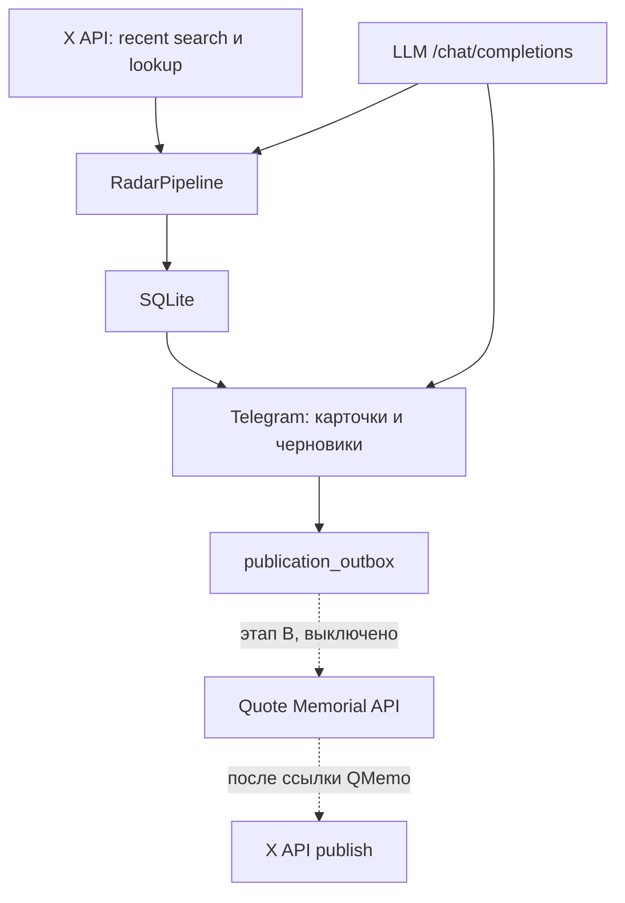
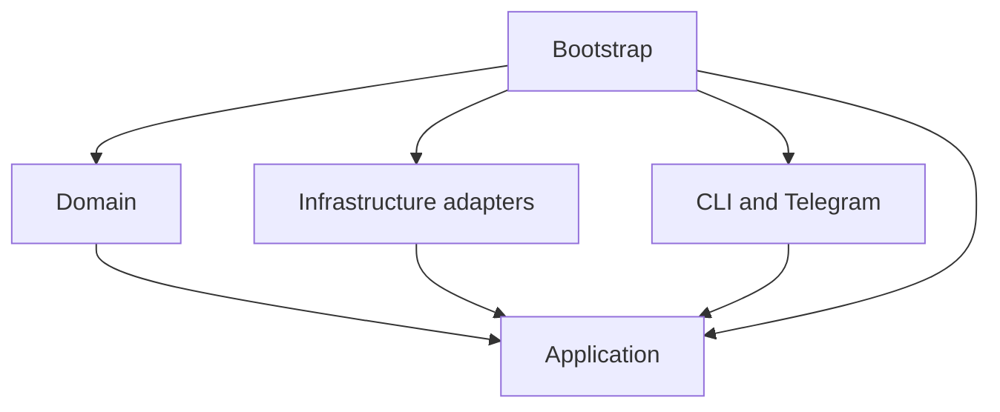
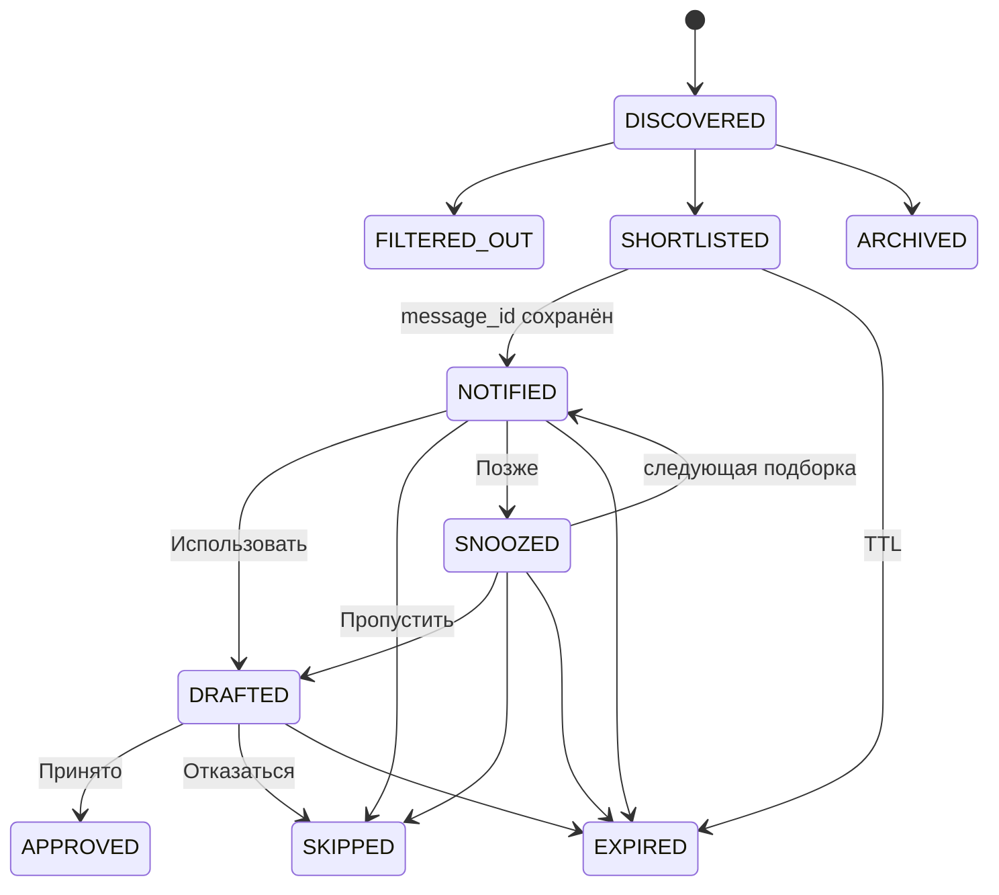
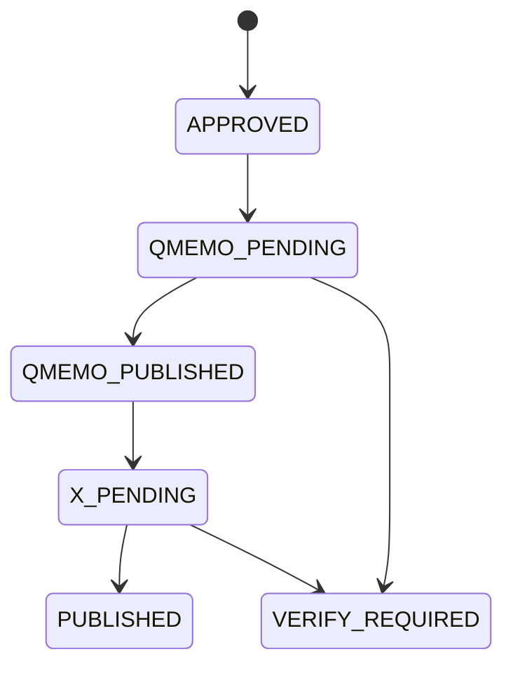

# Архитектура QMemo News Radar

## 1. Архитектурное решение

Radar является самостоятельным сервисом и живёт только в репозитории `aastersi/Qmemo_News_Radar-`.

Он не импортирует код Brain, Dulty, Quote Memorial или других проектов. У него отдельные:

- Python-пакет и зависимости;
- Telegram-бот и токен;
- SQLite-база;
- файл источников;
- переменные окружения;
- Docker-образ;
- тесты и GitHub Actions;
- история версий и выпусков.

Связь с внешними проектами строится через стабильные контракты, а не через общий код или общую базу.

## 2. Почему отдельный сервис

Radar можно запускать, тестировать, обновлять и останавливать без риска повредить Brain. Ошибка X API или Telegram не затронет другие системы. Разработчики Quote Memorial получат один понятный входной контракт (`PublicationPackage`) вместо доступа ко всему маркетинговому коду.

Цена решения — отдельный Telegram-бот и отдельный процесс. Для этой задачи это полезная изоляция.

## 3. Общая схема



Сплошная часть схемы работает, пунктирная не реализована и выключена.

## 4. Правило зависимостей



Стрелка означает «использует». Domain не знает ни об одной библиотеке доставки или хранения. Application знает только domain и Protocol-порты из `application/ports.py`. SQLite, X, LLM, Telegram и publishers реализуют эти порты снаружи. Все конкретные реализации соединяются только в `bootstrap.py`; `interfaces/runtime.py` и CLI получают готовые объекты оттуда.

Запрещены обратные импорты из domain или application в infrastructure и interfaces.

## 5. Структура репозитория

```text
src/qmemo_radar/
  domain/
    enums.py              состояния событий, черновиков, outbox и запусков
    models.py             модели и инварианты ({qmemo_url}, VERIFIED для пакета)
  application/
    ports.py              Protocol-порты
    filtering.py          жёсткие фильтры
    normalization.py      нормализация текста и URL, разбор ручной ссылки X
    scoring.py            пересчёт итогового балла
    pipeline.py           сбор → запись → фильтр → ранжирование
    review.py             доставка карточек, решения, пауза, устаревание
    drafting.py           черновики, проверка цитаты, переделка, одобрение
    outbox.py             сборка PublicationPackage и idempotency_key
    runner.py             один цикл под блокировкой, запись запусков, /status
    scheduler.py          расписание сбора, подборок, устаревания и heartbeat
  infrastructure/
    http.py               повторы: сеть и 5xx, 429 с Retry-After
    llm.py                OpenAI-совместимый клиент и один repair-запрос
    ranking.py            LlmRanker и офлайн-ранжировщик
    drafting.py           LlmDraftWriter и офлайн-писатель
    collectors/x_api.py   XApiClient и XRecentSearchCollector
    storage/              SQLite и миграции 001-005
    publishing/           только выключенные publishers
  interfaces/
    cli.py                команды
    runtime.py            боевой процесс и сигналы
    telegram/controller.py  авторизация, разбор команд и кнопок
    telegram/render.py      HTML-карточки с экранированием
    telegram/bot.py         тонкий слой aiogram и TelegramReviewGateway
  bootstrap.py            единственная точка сборки зависимостей
  config.py               настройки из окружения и схема sources.yaml
tests/                    unit, integration, e2e и fixtures
docs/                     архитектура и пилот
```

Общих папок `utils`, `helpers` или `services` нет. Микросервисов и нескольких ИИ-агентов нет.

## 6. Один цикл Radar

1. `RadarRunner` берёт единственную блокировку; второй запуск (`/run` во время расписания) получает ответ «сбор уже идёт».
2. Collector получает checkpoints и по каждому источнику делает recent search: первый раз с `start_time` на 60 минут назад, дальше с `since_id`.
3. Каждый источник возвращается отдельно; ошибка одного источника записывается в `source_checkpoints` и не останавливает остальные.
4. Нормализатор приводит текст и URL к сравнительной форме, сохраняя оригинал.
5. SQLite атомарно вставляет событие или распознаёт дубль. Checkpoint источника двигается только после записи всех его публикаций.
6. Фильтр убирает старое (кроме ручных ссылок), заблокированных авторов, запрещённые слова, пустые публикации и дубли текста.
7. Ranker оценивает пачки до 10 событий. Невалидный ответ получает одну попытку исправления; после второй ошибки события остаются `DISCOVERED`, пользователю не показываются и будут оценены в следующем цикле.
8. Итоговый балл всегда пересчитывает код: сумма компонентов минус штраф, в пределах 0-100.
9. События от порога подборки становятся `SHORTLISTED`, остальные `ARCHIVED`. Ручные ссылки всегда `SHORTLISTED`.
10. После цикла отправляются срочные карточки (от 80), подборки — по расписанию. Все карточки укладываются в дневной лимит.
11. Запуск получает статус `SUCCESS`, `PARTIAL` (ошибка источника или оценки) или `FAILED`.

Конвейер не является автономным агентом: у него нет рекурсивного планирования и памяти рассуждений. Это предсказуемая последовательность шагов с одним LLM-запросом на пачку ранжирования и одним на черновик.

## 7. Состояния

Состояние маркетингового события хранится отдельно от состояния публикации.



Каждый переход — условный `UPDATE ... WHERE status IN (...)` в транзакции вместе с feedback. Поэтому старая кнопка или двойное нажатие не меняют уже принятое решение.

Черновик: версия 1 `ACTIVE`; после переделки версия 1 `SUPERSEDED`, версия 2 `ACTIVE`; затем `ACCEPTED` или `REJECTED`. `UNIQUE(event_id, version)` и `CHECK(version <= 2)` делают вторую переделку невозможной даже в обход кода. Старые версии не удаляются.



Сейчас существует только `APPROVED`: outbox worker отсутствует. `VERIFY_REQUIRED` предназначен для неясного сетевого результата на этапе B: если запрос мог выполниться, но ответ потерян, автоматический повтор запрещён до проверки внешней системы.

## 8. Хранение

SQLite работает в WAL-режиме с внешними ключами и `busy_timeout`. Миграции лежат рядом с адаптером, входят в пакет и применяются по номеру файла; каждая миграция начиная с 002 выполняется в одной транзакции.

Таблицы:

- `radar_events` — публикации, статус, `source_key`, причина фильтрации;
- `event_scores` — компоненты, итог, объяснение, заголовок, пересказ, версия промпта, модель;
- `telegram_deliveries` — `message_id` каждой отправленной карточки;
- `drafts` — версии черновиков;
- `feedback` — все решения пользователя;
- `publication_outbox` — пакеты публикации;
- `source_checkpoints` — `since_id`, последняя удача и ошибка по каждому источнику;
- `pipeline_runs` — запуски и счётчики;
- `radar_state` — пауза и heartbeat.

Уникальные ограничения `(source, external_id)`, `(source, url)`, `idempotency_key`, `(event_id, version)` и `(chat_id, message_id)` — последний уровень защиты от дублей.

## 9. Контракты

Порты application:

- `SourceCollector` — источники с checkpoints; `PostLookup` — ручная ссылка;
- `Ranker` — пачка до 10 событий;
- `DraftWriter` — черновик или переделка;
- `EventRepository`, `ReviewRepository`, `DraftRepository`, `OutboxRepository`, `RunRepository` — одна реализация SQLite;
- `ReviewGateway` — отправка карточки, возвращает `message_id`;
- `QuotePublisher` и `XPublisher` — зарегистрированы только выключенные реализации.

`PublicationPackage` содержит точную цитату, автора, язык, контекст, текст для QMemo, ссылку и внешний ID источника, шаблон X с `{qmemo_url}`, короткий текст X, призыв к действию, результат проверки фактов, кто и когда одобрил, `idempotency_key`. Пакет нельзя создать без `fact_check_status=VERIFIED`. `idempotency_key` — SHA-256 от источника и внешнего ID, поэтому одна публикация даёт не больше одного пакета.

Будущий Quote Memorial adapter получает готовый пакет и не имеет доступа к сбору, ранжированию или генерации. X publisher запускается только после подтверждённой публикации QMemo и подставляет ссылку вместо `{qmemo_url}` простой заменой строки.

## 10. Одобрение одной транзакцией

`BEGIN IMMEDIATE`, затем: перечитать последнюю версию черновика и событие → application собирает `PublicationPackage` (проверка `DRAFTED`, `ACTIVE`, `VERIFIED`) → `INSERT ... ON CONFLICT(idempotency_key) DO NOTHING` → feedback → черновик `ACCEPTED` → событие `APPROVED` → `COMMIT`. Любая ошибка откатывает всё. Тест внедряет сбой SQLite-триггером на последнем шаге и проверяет отсутствие частичного состояния.

## 11. Runtime

`qmemo-radar run`:

1. проверяет обязательные переменные и `sources.yaml`, при ошибке выходит с кодом 78;
2. отказывается стартовать, если включён любой флаг публикации;
3. применяет миграции и помечает прерванные запуски как `FAILED`;
4. запускает один Telegram poller (только `message` и `callback_query`) и планировщик;
5. по SIGTERM или SIGINT отменяет задачи и закрывает HTTP-клиенты X, LLM и сессию бота.

Планировщик: сбор каждые `RADAR_COLLECT_INTERVAL_MINUTES` (первый сразу после старта), подборки в `RADAR_DIGEST_TIMES`, устаревание раз в час, heartbeat раз в минуту. Outbox worker отсутствует.

Журналы — JSON с полями `run_id`, `event_id`, `module`, `operation`, `result`, `error_code`. Известные секреты вырезаются форматтером; `aiosqlite`, `httpx`, `httpcore` и `aiogram.event` ограничены уровнем WARNING, потому что на низких уровнях пишут параметры SQL и URL.

Однопроцессная модель осознанна: блокировки сбора, доставки и защиты от двойного нажатия живут в процессе. Для одного контейнера с одной SQLite этого достаточно; второй экземпляр на том же томе запускать нельзя.

## 12. Безопасность

- Публикационные флаги выключены и не могут быть включены без реального адаптера.
- Приватные ключи кошелька не хранятся в Radar.
- X используется только через официальный API на чтение.
- Исходный текст и инструкции пользователя передаются модели как экранированные JSON-блоки данных; системный промпт неизменен.
- Telegram обрабатывает команды, сообщения и кнопки только от одного user ID.
- Секреты, полный текст публикаций и промпты не выводятся в журналы.

## 13. Этапы

| Этап | Статус |
| --- | --- |
| Foundation | готово |
| A2 X read-only | готово |
| A3 LLM ranking | готово |
| A4 Telegram | готово |
| A5 Draft | готово |
| A6 Outbox | готово |
| Runtime и Docker | готово |
| B внешняя публикация | не начато, выключено |

## 14. Что запрещено смешивать

- базы Radar и Brain;
- Telegram poller разных приложений;
- `.env` и секреты разных проектов;
- общие внутренние Python-модули через относительные пути;
- прямой импорт кода сайта Quote Memorial;
- публикацию и маркетинговое ранжирование в одном классе;
- сетевые вызовы внутри domain-моделей;
- изменение схемы базы без миграции.

Если нескольким проектам понадобится общий контракт, он оформляется как отдельная версионируемая схема или маленький пакет. Код одного приложения не копируется в другое скрытой общей папкой.
