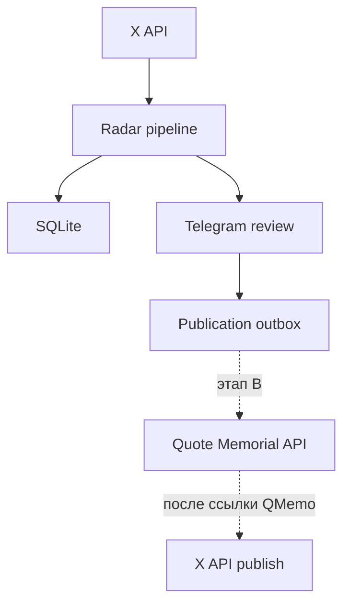
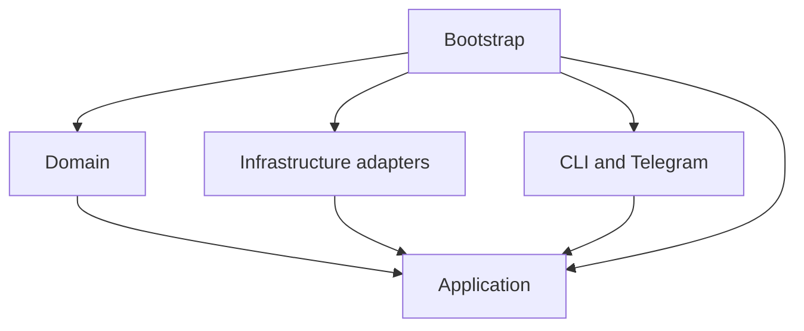
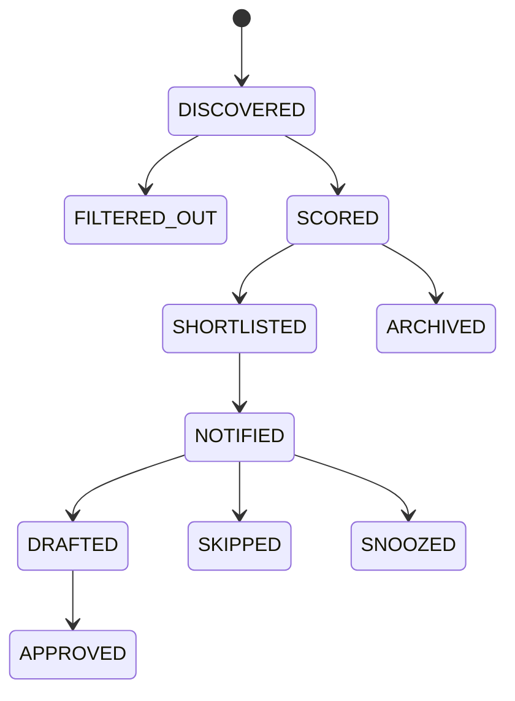
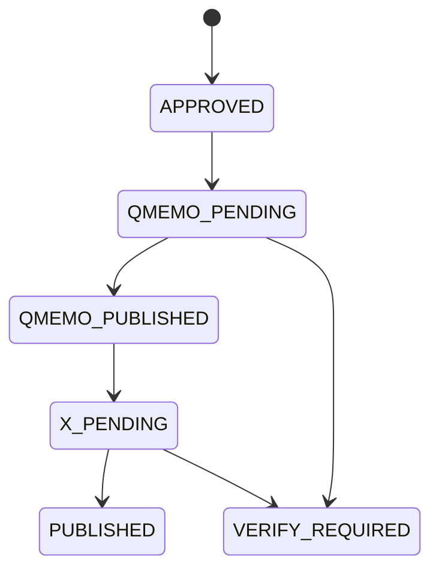

# Архитектура QMemo News Radar

## 1. Архитектурное решение

Radar является самостоятельным сервисом и живёт только в репозитории `aastersi/Qmemo_News_Radar-`.

Он не импортирует код Brain, Dulty, Quote Memorial или других проектов. У него отдельные:

- Python-пакет и зависимости;
- Telegram-бот и токен;
- SQLite-база;
- файл источников;
- переменные окружения;
- Docker-образ;
- тесты и GitHub Actions;
- история версий и выпусков.

Связь с внешними проектами строится через стабильные контракты, а не через общий код или общую базу.

## 2. Почему отдельный сервис

Основная причина не в технической моде, а в контроле границ. Radar можно запускать, тестировать, обновлять и останавливать без риска повредить Brain. Ошибка X API или Telegram не затронет другие системы. Разработчики Quote Memorial получат один понятный входной контракт вместо доступа ко всему маркетинговому коду.

Цена такого решения - отдельный Telegram-бот и отдельный процесс. Для этой задачи это нормальная и полезная изоляция.

## 3. Общая схема



В V0.1 сплошная часть схемы активна, пунктирная выключена.

## 4. Правило зависимостей



Направление стрелки означает «использует». Domain не знает ни об одной библиотеке доставки или хранения. Application знает только domain и порты. SQLite, X, Telegram, LLM и publisher реализуют эти порты снаружи. Все конкретные реализации соединяются только в `bootstrap.py`.

Запрещены обратные импорты из domain или application в infrastructure.

## 5. Структура репозитория

```text
src/qmemo_radar/
  domain/                 модели, состояния и инварианты
  application/            use cases, pipeline и порты
  infrastructure/
    collectors/           X и тестовые источники
    storage/              SQLite и миграции
    publishing/           выключенные и будущие адаптеры
  interfaces/             CLI и будущий Telegram adapter
  bootstrap.py            единственная точка сборки зависимостей
  config.py               настройки из окружения
tests/                    unit и integration тесты
docs/                     решения и контракты
```

Не добавлять общие папки `utils`, `helpers` или `services` без ясной ответственности. Не создавать микросервисы для отдельных шагов конвейера.

## 6. Один цикл Radar

1. Collector получает новые публикации.
2. Нормализатор приводит текст и URL к сравнительной форме, сохраняя оригинал.
3. SQLite атомарно вставляет событие или распознаёт дубль.
4. Жёсткий фильтр удаляет старое, запрещённое и бессодержательное.
5. Ranker оценивает пачку максимум из 10 событий.
6. Код сам пересчитывает итоговый балл.
7. События с баллом от 65 становятся `SHORTLISTED`.
8. Telegram показывает ограниченное число карточек человеку.
9. После ручного принятия создаётся один `PublicationPackage` в outbox.
10. В V0.1 процесс заканчивается без внешней публикации.

Конвейер не является автономным рассуждающим агентом. У него нет рекурсивного планирования, памяти рассуждений и нескольких моделей. Это предсказуемая последовательность операций с одним LLM-вызовом для ранжирования и одним для подготовки выбранного материала.

## 7. Состояния

Состояние маркетингового события хранится отдельно от состояния публикации.





`VERIFY_REQUIRED` нужен для неясного сетевого результата. Если запрос мог выполниться, но ответ потерян, автоматический повтор запрещён до проверки внешней системы.

## 8. Хранение

SQLite работает в WAL-режиме с внешними ключами и `busy_timeout`. Миграции находятся рядом с адаптером хранения и входят в пакет приложения.

Основные таблицы:

- `radar_events`;
- `event_scores`;
- `telegram_deliveries`;
- `drafts`;
- `feedback`;
- `publication_outbox`;
- `source_checkpoints`;
- `pipeline_runs`.

Уникальные ограничения на `(source, external_id)`, `(source, url)` и `idempotency_key` являются последним уровнем защиты от дублей.

## 9. Интеграционные контракты

Application использует только пять портов:

- `SourceCollector`;
- `Ranker`;
- `EventRepository`;
- `ReviewGateway`;
- `QuotePublisher` и `XPublisher`.

Будущий Quote Memorial adapter получает готовый `PublicationPackage`. Он не имеет доступа к сбору, ранжированию или генерации материала. X publisher запускается только после подтверждённой публикации QMemo и получения канонической ссылки.

## 10. Безопасность

- Публикационные флаги выключены по умолчанию.
- Приватные ключи кошелька не хранятся в Radar.
- X используется только через официальный API.
- Исходный текст рассматривается как недоверенный ввод.
- Telegram разрешает команды только одному заданному user ID.
- Секреты не выводятся в журналы.
- Production-запуск работает fail-closed, пока реальные адаптеры не подключены.

## 11. Этапы разработки

### Foundation - текущий срез

- package layout;
- domain и application contracts;
- нормализация, фильтрация и пересчёт балла;
- SQLite и миграция;
- dry-run;
- отключённые publishers;
- unit и integration тесты;
- CI и Docker.

### A2 - X read-only

- официальный recent search и lookup;
- `since_id` по каждому запросу;
- пагинация;
- повторяемые ошибки и 429;
- тесты через `httpx.MockTransport`.

### A3 - LLM ranking

- структурированный ответ;
- пакет до 10 событий;
- один repair retry;
- fixtures и проверка порядка приоритетов;
- сохранение версии промпта и модели.

### A4 - Telegram

- отдельный bot token;
- карточки и подборки;
- доступ по одному user ID;
- защита от двойных callback;
- команды состояния и ручного запуска.

### A5 - Draft и outbox

- точная цитата из первоисточника;
- одна переделка;
- ручная проверка спорных фактов;
- атомарное принятие и один пакет.

### B - внешняя публикация

- контракт с разработчиками Quote Memorial;
- QuotePublisher;
- получение канонической ссылки;
- XPublisher;
- идемпотентность и восстановление после сбоев.

## 12. Что запрещено смешивать

- базы Radar и Brain;
- Telegram poller разных приложений;
- `.env` и секреты разных проектов;
- общие внутренние Python-модули через относительные пути;
- прямой импорт кода сайта Quote Memorial;
- публикацию и маркетинговое ранжирование в одном классе;
- сетевые вызовы внутри domain-моделей;
- изменение схемы базы без миграции.

Если позже нескольким проектам действительно понадобится общий контракт, он оформляется как отдельная версионируемая схема или маленький пакет. Код одного приложения не копируется в другое скрытой общей папкой.

