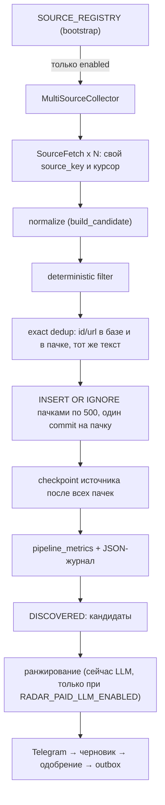
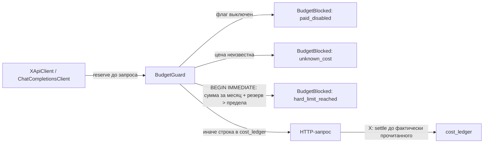

# Open Web Radar: multi-source foundation (M1-M2) и план M3

Цель продукта: Radar читает открытые источники (GDELT, RSS/Atom, Bluesky, Hacker News, GitHub, YouTube) и оставляет X опциональным платным источником и resolver для известных ссылок X. Стартовый поток — 200 000 объектов в неделю, запас архитектуры — 1 000 000. Внешние API: цель $0 в месяц, жёсткий предел $10.

## 1. M1: аудит baseline (PR #2, `c3df5da`)

### Границы слоёв

Правило зависимостей из [ARCHITECTURE.md](ARCHITECTURE.md) соблюдено: domain не импортирует ничего, кроме pydantic; application зависит от domain и Protocol-портов; infrastructure и interfaces реализуют порты; всё конкретное соединяется в `bootstrap.py`.

### Что уже было общим

| Часть | Вывод |
| --- | --- |
| `SourceCollector` | порт `collect(checkpoints) -> list[SourceFetch]` не знает про X |
| `SourceFetch` | `source_key`, элементы, курсор, код ошибки — подходит любому источнику |
| `RawSourceItem` | общая единица; поля автора и `Engagement` необязательны, специфичное лежит в `raw_payload` |
| `pipeline` | не знает источник; checkpoint двигается только после записи всех элементов |
| `filtering` | общие правила; `_NOISE` убирает `@`, `#`, `$` и URL — безвредно для новостей |
| `ranking` (порт) | принимает `EventCandidate`, источник не важен |
| checkpoints | `source_checkpoints` по произвольному `source_key` |
| `scheduler`, `runner` | не знают источник |
| уникальность | `UNIQUE(source, external_id)` и `UNIQUE(source, url)` — дубли разделены по источнику |

### Что предполагало X

| Место | Было | Стало в M2 |
| --- | --- | --- |
| `SourceType` | `X`, `RSS`, `MANUAL` | 8 типов, без миграции |
| `bootstrap.build_runtime` | X-коллектор и X-токен обязательны | реестр источников, X только при платных флагах |
| `config.production_problems` | требовал X и LLM | требует только то, что включено |
| `/status` | «X: источники…» | «Источники: …» |
| ранжирование без LLM | не было варианта | ранжирование пропускается, события ждут или устаревают |
| `normalization.parse_x_status_url`, `review.submit_link`, `PostLookup` | X | остаётся X намеренно: resolver ссылок X |
| промпт ранжирования `rank-v1`, `DeterministicDraftWriter` | «public X posts», «в X» | не менялось: смена промпта меняет поведение пилота; делается в M4 вместе с новой версией промпта |
| `Engagement` | метрики соцсети | необязательные поля, для новостей нули |

### Git-стратегия

- PR #2 (`feat/radar-launch-ready`) не сливается автоматически и остаётся стабильным launch-ready baseline для пилота X.
- M2 ведётся в `feat/multi-source-foundation`, ответвлённой от `c3df5da`. PR M2 открыт в базу `feat/radar-launch-ready` (stacked PR): diff показывает только M2.
- Когда владелец сольёт #2 в `main` (и удалит ветку), GitHub сам переключит базу PR M2 на `main`. Если ветку #2 не удалять, базу нужно сменить вручную.
- Правки пилота делаются в ветке #2, затем M2 обновляется `git merge feat/radar-launch-ready` (без rebase и force-push опубликованной истории).
- M3 и дальше — отдельные ветки от `feat/multi-source-foundation`, по PR на milestone.
- Миграции нумеруются одной последовательностью на обе ветки: исправление пилота в #2 не может добавить `006`-`008` (они заняты M2), иначе раннер, который помнит только номер версии, молча пропустит миграцию M2. Новая миграция в #2 получает следующий свободный номер после M2 и сразу переносится в M2 merge-ом.

## 2. M2: архитектура ingestion

- **Реестр.** `SOURCE_REGISTRY` в `bootstrap.py`: имя, функция «включён ли», фабрика. Отключённый источник не строится, поэтому не требует ключей. Сейчас в реестре `x_search`; M3 добавляет `gdelt_gqg` и `rss`.
- **Изоляция.** `MultiSourceCollector` запускает коллекторы параллельно. Исключение одного превращается в `SourceFetch(error_code="collector_failed:<тип>")` под именем из реестра; остальные работают дальше. Успешный запуск коллектора записывает успех под тем же именем, поэтому прошлый сбой не висит в `/status`. Внутри X ошибка одного запроса изолирована, если это ошибка API или бюджета.
- **Журнал старта.** `radar capabilities` перечисляет включённые источники и состояние ранжирования; если нет источников или LLM, это warning.
- **Checkpoints.** У каждого `source_key` свой курсор. Новые источники обязаны начинать ключ с имени в реестре (`rss:<feed>`, `gdelt:gqg`). X сохраняет исторические `account:<handle>` и `query:<name>`, чтобы не терять курсоры пилота.
- **Без дублей.** Повторный элемент распознаётся до вставки по `(source, external_id)` и `(source, url)`, внутри пачки — по множеству; уникальные индексы остаются последним уровнем защиты. Тот же текст (из любого источника, в том числе из той же пачки) сохраняется `FILTERED_OUT` с `filter_reason=duplicate_content` и `duplicate_of_event_id` — это будущий сигнал «цитату повторили N источников».
- **Отфильтрованное сохраняется** со статусом `FILTERED_OUT`, чтобы retention удалял шум по правилам, а не по случайности.
- **Страховочная проверка.** Перед ранжированием первые 100 `DISCOVERED` проверяются ещё раз: это ручные ссылки, события старых версий и кандидаты, устаревшие в ожидании.

### Метрики

`pipeline_metrics(run_id, source_key, metric, value, recorded_at)` — узкая таблица: новое имя метрики не требует миграции. Те же числа пишутся в журнал (`"message": "source collected", "result": "collected=… inserted=…"`) и выводятся `qmemo-radar status` за 24 часа.

| Метрика | Смысл |
| --- | --- |
| `collected` | элементов вернул источник |
| `inserted` | новых строк, включая отфильтрованные и копии текста |
| `exact_duplicates` | уже сохранённый элемент или тот же текст, что у более раннего |
| `filtered` | отброшено правилами (возраст, длина, авторы, слова) |
| `source_errors` | ошибок источника |
| `near_duplicates`, `clusters_created`, `clusters_merged`, `preselected`, `local_llm_calls`, `telegram_delivered` | имена зарезервированы в `Metric`, пока не пишутся |

`PipelineCounters.duplicates` теперь включает копии текста; раньше они считались в `filtered`.

### Пропускная способность

До M2 каждый элемент открывал соединение SQLite, выполнял четыре PRAGMA и отдельный commit: замер 7,6 мс на элемент (~130 элементов/с). Пакеты по 500: 0,046 мс на запись. Тест `tests/test_throughput.py` прогоняет 200 000 синтетических элементов из четырёх источников в каждом CI; 1 000 000 — только с `RADAR_BENCHMARK_1M=1`. Результаты — в отчёте PR.

## 3. BudgetGuard и cost ledger

- Любой платный адаптер получает единственный `BudgetGuard` процесса как обязательный аргумент конструктора. Бесплатные коллекторы его не получают, поэтому исчерпанный бюджет их не останавливает.
- Резерв записывается до **каждой попытки** запроса, включая автоматические повторы, внутри `BEGIN IMMEDIATE`: параллельные задачи и второй процесс ждут блокировку записи (до `busy_timeout` 5 с), поэтому не могут вместе превысить предел (тест: 20 параллельных вызовов по $0,30 при пределе $1 — проходят ровно 3). Если ledger недоступен дольше, вызов блокируется с кодом `ledger_unavailable`.
- Деньги хранятся целыми микродолларами, округление вверх.
- X: каждая попытка резервирует худший случай страницы (100 постов × $0,005 + 100 авторов × $0,010 = $1,50). Успешный ответ уменьшает резерв до прочитанного, ответ с ошибкой (4xx, 5xx, 429) — до нуля, потому что X берёт плату за возвращённые ресурсы. Если ответ потерян (таймаут, обрыв, остановка процесса), резерв остаётся полным. Если бюджет кончился на второй или следующей странице, уже оплаченные страницы сохраняются. LLM: каждая попытка резервирует оценку и не уменьшается. Цены — [docs.x.com pricing](https://docs.x.com/x-api/getting-started/pricing), проверено 2026-09-17; оплачиваются ли авторы из `includes`, не указано, поэтому они считаются платными.
- LLM: цена запроса коду неизвестна. Без `RADAR_LLM_COST_PER_CALL_USD` любой платный LLM-вызов блокируется. Это и есть явный безопасный override: владелец указывает верхнюю оценку за запрос; обойти блокировку без оценки нельзя.
- Цель `RADAR_COST_TARGET_USD_MONTHLY` (по умолчанию 0): превышение пишет warning. Предел `RADAR_COST_HARD_LIMIT_USD_MONTHLY` (по умолчанию и максимум 10): блокирует.
- Блокировка в ранжировании = провайдер недоступен: события остаются `DISCOVERED`, запуск `PARTIAL`. В X-источнике = ошибка источника в `/status`.

| Флаг | По умолчанию | Что разрешает |
| --- | --- | --- |
| `RADAR_PAID_SOURCES_ENABLED` | `false` | любые платные источники, включая lookup ручных ссылок X |
| `RADAR_X_PAID_SEARCH_ENABLED` | `false` | X recent search (только вместе с предыдущим) |
| `RADAR_PAID_LLM_ENABLED` | `false` | LLM-ранжирование и черновики |

## 4. Изменения схемы SQLite

| Миграция | Изменение |
| --- | --- |
| `006_cost_ledger.sql` | `cost_ledger(id, provider, operation, units, estimated_cost_micros, created_at)` + индекс по времени |
| `007_pipeline_metrics.sql` | `pipeline_metrics(run_id, source_key, metric, value, recorded_at)` + индекс по времени |
| `008_retention_indexes.sql` | индексы `radar_events(duplicate_of_event_id)`, `feedback(event_id)`, `publication_outbox(event_id)` для быстрого подсчёта retention |

Существующие колонки `radar_events.filter_reason` и `duplicate_of_event_id` (есть с миграции 001) теперь заполняются при вставке; если оригинал не был записан (гонка с ручной ссылкой), ссылка становится NULL вместо ошибки внешнего ключа. Новые значения `SourceType` миграции не требуют: `source` — TEXT без CHECK.

## 5. Retention

- `RADAR_RAW_RETENTION_DAYS` (по умолчанию 14, от 7).
- Кандидаты на удаление: `FILTERED_OUT`, `EXPIRED`, `ARCHIVED` старше срока, без доставки в Telegram, черновиков, feedback, пакета outbox и без сохранённых копий, ссылающихся на событие.
- Сейчас только подсчёт: `qmemo-radar status` → `retention.prunable_events`. Автоматического удаления нет.

План включения удаления (отдельный milestone):

1. Неделю наблюдать `prunable_events` и размер базы на реальном потоке.
2. Добавить команду `qmemo-radar prune --apply` с резервной копией перед первым запуском и удалением пачками по 1000: сначала копии (`duplicate_of_event_id IS NOT NULL`), затем оригиналы; `event_scores` удаляются каскадом.
3. Только после ручной проверки — ежедневная задача в планировщике.
4. `pipeline_metrics` агрегировать по суткам старше 30 дней; `cost_ledger` не удалять.

## 6. Будущая цепочка отбора

| Шаг | Где живёт | Статус |
| --- | --- | --- |
| raw ingestion | коллекторы из реестра | M2 |
| normalization | `build_candidate` | M2 |
| deterministic filtering | `first_filter_reason` при вставке | M2 |
| exact dedup | id/url + `content_hash` при вставке | M2 |
| near dedup | новый шаг над `DISCOVERED` перед ранжированием, метрика `near_duplicates` | M4 |
| event clustering | таблица кластеров, `duplicate_of_event_id` как первый сигнал | M4 |
| cheap preselection | порт `Preselector`: выбирает, какие `DISCOVERED` уходят дальше, остальные `ARCHIVED` | M4 |
| local semantic stage | локальные эмбеддинги без внешнего API | M5 |
| local LLM ranking | существующий порт `Ranker` с локальной моделью, метрика `local_llm_calls` | M5 |
| Telegram / черновик / outbox | без изменений | есть |

Правило: новые шаги читают `DISCOVERED` после вставки и до `Ranker`; в `_ingest` их не добавлять, чтобы вставка оставалась быстрой и идемпотентной.

## 7. План M3: GDELT GQG + RSS

Ограничения M3: $0 внешних расходов, без новых инфраструктурных зависимостей, без Reddit и остальных источников.

### 7.1 GDELT Global Quotation Graph (`gdelt_gqg`)

Факты из [анонса GDELT](https://blog.gdeltproject.org/announcing-the-global-quotation-graph/): файлы `https://data.gdeltproject.org/gdeltv3/gqg/YYYYMMDDHHMMSS.gqg.json.gz`, gzip JSONL, по файлу в минуту с публикацией блоками раз в ~15 минут и задержкой 2-5 минут; запись: `date`, `url`, `title`, `lang`, `quotes[]` с `pre`, `quote`, `post`; 152 языка.

1. Перед кодом: проверить, что свежие файлы за последние сутки существуют, и прочитать условия использования GDELT.
2. `infrastructure/collectors/gdelt_gqg.py`: бесплатный `httpx`-клиент без BudgetGuard, `send_with_retry`, таймауты, лимит размера ответа.
3. Курсор `gdelt:gqg` = последняя обработанная минута `YYYYMMDDHHMMSS`. Первый запуск: последние `RADAR_MAX_EVENT_AGE_MINUTES`. За один сбор — не больше 60 минутных файлов; 404 для ещё не опубликованной минуты не ошибка, курсор на ней останавливается.
4. Распаковка `gzip` из стандартной библиотеки потоково, построчный `json.loads`, битая строка пропускается с warning.
5. Одна цитата = один `RawSourceItem`: `source=GDELT`, `external_id = sha256(url + quote)[:32]`, `url` статьи, `original_text = quote`, `published_at = date`, `language` из `lang`, `author_display_name = None`; `title`, `pre`, `post` — в `raw_payload` (обрезанные).
6. `sources.yaml`: секция `gdelt: {enabled, languages: [...], min_quote_length, max_files_per_run}`; фильтр языков и длины — в коллекторе до `RawSourceItem`, чтобы не создавать лишние объекты.
7. Тесты: `MockTransport` с gzip-фикстурой, курсор и пропущенные минуты, 404, битые строки, фильтр языков, повторный запуск без дублей, отключённый источник не делает запросов.

### 7.2 RSS/Atom (`rss`)

1. `sources.yaml`: `rss: {enabled, feeds: [{name, url, enabled}]}`, `name` по шаблону `^[a-z0-9_]{1,40}$`, ключ `rss:<name>`.
2. `infrastructure/collectors/rss.py`: общий бесплатный `httpx.AsyncClient`, conditional GET: курсор хранит `ETag`/`Last-Modified`, `304` = пустая успешная выборка.
3. Разбор стандартным `xml.etree.ElementTree` (встроенный expat защищает от billion laughs, внешние сущности не загружаются) с лимитом ответа 5 МБ; RSS 2.0 `item` и Atom `entry`. Новая зависимость (`feedparser`) не добавляется, пока стандартной библиотеки хватает.
4. `external_id` = `guid`/`id`, иначе канонический URL; `original_text` = заголовок + описание без HTML (`html.unescape` и удаление тегов); `published_at` из `pubDate`/`updated` через `email.utils`/`datetime.fromisoformat`, без даты — время сбора.
5. Ленты опрашиваются параллельно с ограничением одновременных запросов; ошибка одной ленты — ошибка только её `source_key`.
6. Тесты: RSS 2.0 и Atom фикстуры, `304`, ETag, HTML в описании, битый XML, слишком большой ответ, дубли между лентами (`duplicate_content`), независимые checkpoints.

### 7.3 Общие шаги M3

1. Зарегистрировать `gdelt_gqg` и `rss` в `SOURCE_REGISTRY`; `check-config` показывает их в `sources_enabled`.
2. Решить, что делать с потоком без LLM: до M4 кандидаты от GDELT/RSS не ранжируются и устаревают, либо временно ограничить их долю в очереди `DISCOVERED` (например, отдельным порогом возраста). Решение фиксируется с владельцем до включения на проде.
3. Нагрузочный тест с реальными формами фикстур GDELT и RSS в составе 200k.
4. Документация: `.env.example`, `sources.example.yaml`, README, этот файл.
5. Наблюдение 3 дня: `qmemo-radar status` (`ingestion_24h`, `cost_month_usd` = 0, `retention`).

Критерии готовности M3: оба источника работают при всех платных флагах `false`; `cost_ledger` пуст; падение одного источника не влияет на другой; повторный запуск не создаёт дублей; ruff, mypy, pytest, docker build зелёные.
