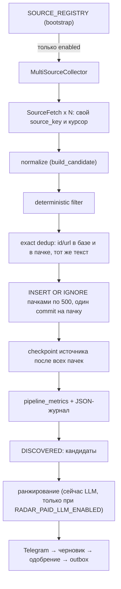
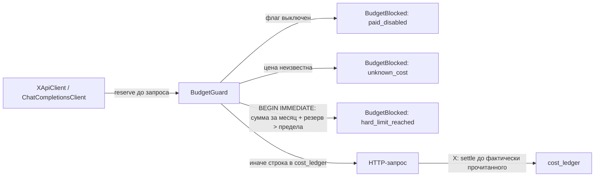

# Open Web Radar: multi-source foundation (M1-M2) и план M3

Цель продукта: Radar читает открытые источники (GDELT, RSS/Atom, Bluesky, Hacker News, GitHub, YouTube) и оставляет X опциональным платным источником и resolver для известных ссылок X. Стартовый поток — 200 000 объектов в неделю, запас архитектуры — 1 000 000. Внешние API: цель $0 в месяц, жёсткий предел $10.

## 1. M1: аудит baseline (PR #2, `c3df5da`)

### Границы слоёв

Правило зависимостей из [ARCHITECTURE.md](ARCHITECTURE.md) соблюдено: domain не импортирует ничего, кроме pydantic; application зависит от domain и Protocol-портов; infrastructure и interfaces реализуют порты; всё конкретное соединяется в `bootstrap.py`.

### Что уже было общим

| Часть | Вывод |
| --- | --- |
| `SourceCollector` | порт `collect(checkpoints) -> list[SourceFetch]` не знает про X |
| `SourceFetch` | `source_key`, элементы, курсор, код ошибки — подходит любому источнику |
| `RawSourceItem` | общая единица; поля автора и `Engagement` необязательны, специфичное лежит в `raw_payload` |
| `pipeline` | не знает источник; checkpoint двигается только после записи всех элементов |
| `filtering` | общие правила; `_NOISE` убирает `@`, `#`, `$` и URL — безвредно для новостей |
| `ranking` (порт) | принимает `EventCandidate`, источник не важен |
| checkpoints | `source_checkpoints` по произвольному `source_key` |
| `scheduler`, `runner` | не знают источник |
| уникальность | `UNIQUE(source, external_id)` и `UNIQUE(source, url)` — дубли разделены по источнику |

### Что предполагало X

| Место | Было | Стало в M2 |
| --- | --- | --- |
| `SourceType` | `X`, `RSS`, `MANUAL` | 8 типов, без миграции |
| `bootstrap.build_runtime` | X-коллектор и X-токен обязательны | реестр источников, X только при платных флагах |
| `config.production_problems` | требовал X и LLM | требует только то, что включено |
| `/status` | «X: источники…» | «Источники: …» |
| ранжирование без LLM | не было варианта | ранжирование пропускается, события ждут или устаревают |
| `normalization.parse_x_status_url`, `review.submit_link`, `PostLookup` | X | остаётся X намеренно: resolver ссылок X |
| промпт ранжирования `rank-v1`, `DeterministicDraftWriter` | «public X posts», «в X» | не менялось: смена промпта меняет поведение пилота; делается в M4 вместе с новой версией промпта |
| `Engagement` | метрики соцсети | необязательные поля, для новостей нули |

### Git-стратегия

- PR #2 и PR #3 (M1+M2) слиты в `main` merge-коммитами (`58ef8fe`, `4f5223f`).
- Каждый следующий milestone — отдельная ветка от актуального `main` и один PR в `main`, без stacked PR. M3: `feat/m3-free-ingestion`.
- Миграции нумеруются одной последовательностью: раннер помнит только номер версии, поэтому номер не переиспользуется.

## 2. M2: архитектура ingestion

- **Реестр.** `SOURCE_REGISTRY` в `bootstrap.py`: имя, функция «включён ли», фабрика. Отключённый источник не строится, поэтому не требует ключей. В реестре `x_search`, `gdelt_gqg`, `rss`.
- **Изоляция.** `MultiSourceCollector` запускает коллекторы параллельно. Исключение одного превращается в `SourceFetch(error_code="collector_failed:<тип>")` под именем из реестра; остальные работают дальше. Успешный запуск коллектора записывает успех под тем же именем, поэтому прошлый сбой не висит в `/status`. Внутри X ошибка одного запроса изолирована, если это ошибка API или бюджета.
- **Журнал старта.** `radar capabilities` перечисляет включённые источники и состояние ранжирования; если нет источников или LLM, это warning.
- **Checkpoints.** У каждого `source_key` свой курсор. Новые источники обязаны начинать ключ с имени в реестре (`rss:<feed>`, `gdelt:gqg`). X сохраняет исторические `account:<handle>` и `query:<name>`, чтобы не терять курсоры пилота.
- **Без дублей.** Повторный элемент распознаётся до вставки по `(source, external_id)` и `(source, url)`, внутри пачки — по множеству; уникальные индексы остаются последним уровнем защиты. Тот же текст (из любого источника, в том числе из той же пачки) сохраняется `FILTERED_OUT` с `filter_reason=duplicate_content` и `duplicate_of_event_id` — это будущий сигнал «цитату повторили N источников».
- **Отфильтрованное сохраняется** со статусом `FILTERED_OUT`, чтобы retention удалял шум по правилам, а не по случайности.
- **Страховочная проверка.** Перед ранжированием первые 100 `DISCOVERED` проверяются ещё раз: это ручные ссылки, события старых версий и кандидаты, устаревшие в ожидании.

### Метрики

`pipeline_metrics(run_id, source_key, metric, value, recorded_at)` — узкая таблица: новое имя метрики не требует миграции. Те же числа пишутся в журнал (`"message": "source collected", "result": "collected=… inserted=…"`) и выводятся `qmemo-radar status` за 24 часа.

| Метрика | Смысл |
| --- | --- |
| `collected` | элементов вернул источник |
| `inserted` | новых строк, включая отфильтрованные и копии текста |
| `exact_duplicates` | уже сохранённый элемент или тот же текст, что у более раннего |
| `filtered` | отброшено правилами (возраст, длина, авторы, слова) |
| `source_errors` | ошибок источника |
| собственные счётчики источника | `SourceFetch.stats` пишется под тем же `source_key` без миграции: GDELT `files_checked`, `files_found`, `expected_gaps`, `files_oversized`, `files_corrupt`, `files_truncated`, `articles_seen`, `articles_language_skipped`, `malformed_rows`, `quotes_seen`, `quotes_accepted`, `quotes_rejected`, `quotes_too_long`; RSS `feeds_checked`, `feeds_304`, `feed_errors`, `entries_seen`, `entries_accepted`, `entries_rejected` |
| `near_duplicates`, `clusters_created`, `clusters_merged`, `preselected`, `local_llm_calls`, `telegram_delivered` | имена зарезервированы в `Metric`, пока не пишутся |

`PipelineCounters.duplicates` теперь включает копии текста; раньше они считались в `filtered`.

### Пропускная способность

До M2 каждый элемент открывал соединение SQLite, выполнял четыре PRAGMA и отдельный commit: замер 7,6 мс на элемент (~130 элементов/с). Пакеты по 500: 0,046 мс на запись. Тест `tests/test_throughput.py` прогоняет 200 000 синтетических элементов из четырёх источников в каждом CI; 1 000 000 — только с `RADAR_BENCHMARK_1M=1`. Результаты — в отчёте PR.

## 3. BudgetGuard и cost ledger

- Любой платный адаптер получает единственный `BudgetGuard` процесса как обязательный аргумент конструктора. Бесплатные коллекторы его не получают, поэтому исчерпанный бюджет их не останавливает.
- Резерв записывается до **каждой попытки** запроса, включая автоматические повторы, внутри `BEGIN IMMEDIATE`: параллельные задачи и второй процесс ждут блокировку записи (до `busy_timeout` 5 с), поэтому не могут вместе превысить предел (тест: 20 параллельных вызовов по $0,30 при пределе $1 — проходят ровно 3). Если ledger недоступен дольше, вызов блокируется с кодом `ledger_unavailable`.
- Деньги хранятся целыми микродолларами, округление вверх.
- X: каждая попытка резервирует худший случай страницы (100 постов × $0,005 + 100 авторов × $0,010 = $1,50). Успешный ответ уменьшает резерв до прочитанного, ответ с ошибкой (4xx, 5xx, 429) — до нуля, потому что X берёт плату за возвращённые ресурсы. Если ответ потерян (таймаут, обрыв, остановка процесса), резерв остаётся полным. Если бюджет кончился на второй или следующей странице, уже оплаченные страницы сохраняются. LLM: каждая попытка резервирует оценку и не уменьшается. Цены — [docs.x.com pricing](https://docs.x.com/x-api/getting-started/pricing), проверено 2026-09-17; оплачиваются ли авторы из `includes`, не указано, поэтому они считаются платными.
- LLM: цена запроса коду неизвестна. Без `RADAR_LLM_COST_PER_CALL_USD` любой платный LLM-вызов блокируется. Это и есть явный безопасный override: владелец указывает верхнюю оценку за запрос; обойти блокировку без оценки нельзя.
- Цель `RADAR_COST_TARGET_USD_MONTHLY` (по умолчанию 0): превышение пишет warning. Предел `RADAR_COST_HARD_LIMIT_USD_MONTHLY` (по умолчанию и максимум 10): блокирует.
- Блокировка в ранжировании = провайдер недоступен: события остаются `DISCOVERED`, запуск `PARTIAL`. В X-источнике = ошибка источника в `/status`.

| Флаг | По умолчанию | Что разрешает |
| --- | --- | --- |
| `RADAR_PAID_SOURCES_ENABLED` | `false` | любые платные источники, включая lookup ручных ссылок X |
| `RADAR_X_PAID_SEARCH_ENABLED` | `false` | X recent search (только вместе с предыдущим) |
| `RADAR_PAID_LLM_ENABLED` | `false` | LLM-ранжирование и черновики |

## 4. Изменения схемы SQLite

| Миграция | Изменение |
| --- | --- |
| `006_cost_ledger.sql` | `cost_ledger(id, provider, operation, units, estimated_cost_micros, created_at)` + индекс по времени |
| `007_pipeline_metrics.sql` | `pipeline_metrics(run_id, source_key, metric, value, recorded_at)` + индекс по времени |
| `008_retention_indexes.sql` | индексы `radar_events(duplicate_of_event_id)`, `feedback(event_id)`, `publication_outbox(event_id)` для быстрого подсчёта retention |
| `009_quote_urls.sql` (M3) | пересборка `radar_events` без табличного `UNIQUE(source, url)`: цитаты одной статьи GDELT делят URL. Для остальных источников — частичный уникальный индекс `idx_events_source_url ... WHERE source != 'gdelt'`; строки, rowid, дочерние таблицы и индексы сохраняются |

Существующие колонки `radar_events.filter_reason` и `duplicate_of_event_id` (есть с миграции 001) теперь заполняются при вставке; если оригинал не был записан (гонка с ручной ссылкой), ссылка становится NULL вместо ошибки внешнего ключа. Новые значения `SourceType` миграции не требуют: `source` — TEXT без CHECK.

## 5. Retention

- `RADAR_RAW_RETENTION_DAYS` (по умолчанию 14, от 7).
- Кандидаты на удаление: `FILTERED_OUT`, `EXPIRED`, `ARCHIVED` старше срока, без доставки в Telegram, черновиков, feedback, пакета outbox и без сохранённых копий, ссылающихся на событие.
- Сейчас только подсчёт: `qmemo-radar status` → `retention.prunable_events`. Автоматического удаления нет.

План включения удаления (отдельный milestone):

1. Неделю наблюдать `prunable_events` и размер базы на реальном потоке.
2. Добавить команду `qmemo-radar prune --apply` с резервной копией перед первым запуском и удалением пачками по 1000: сначала копии (`duplicate_of_event_id IS NOT NULL`), затем оригиналы; `event_scores` удаляются каскадом.
3. Только после ручной проверки — ежедневная задача в планировщике.
4. `pipeline_metrics` агрегировать по суткам старше 30 дней; `cost_ledger` не удалять.

## 6. Будущая цепочка отбора

| Шаг | Где живёт | Статус |
| --- | --- | --- |
| raw ingestion | коллекторы из реестра | M2 |
| normalization | `build_candidate` | M2 |
| deterministic filtering | `first_filter_reason` при вставке | M2 |
| exact dedup | id/url + `content_hash` при вставке | M2 |
| near dedup | новый шаг над `DISCOVERED` перед ранжированием, метрика `near_duplicates` | M4 |
| event clustering | таблица кластеров, `duplicate_of_event_id` как первый сигнал | M4 |
| cheap preselection | порт `Preselector`: выбирает, какие `DISCOVERED` уходят дальше, остальные `ARCHIVED` | M4 |
| local semantic stage | локальные эмбеддинги без внешнего API | M5 |
| local LLM ranking | существующий порт `Ranker` с локальной моделью, метрика `local_llm_calls` | M5 |
| Telegram / черновик / outbox | без изменений | есть |

Правило: новые шаги читают `DISCOVERED` после вставки и до `Ranker`; в `_ingest` их не добавлять, чтобы вставка оставалась быстрой и идемпотентной.

## 7. M3: бесплатный ingestion — GDELT GQG + RSS/Atom

Оба источника бесплатны, без ключей и без `BudgetGuard`. Все платные флаги остаются `false`, `cost_ledger` не пополняется (проверено тестами и живым прогоном).

### 7.1 GDELT Global Quotation Graph (`gdelt_gqg`, ключ `gdelt:gqg`)

Источник: [анонс GDELT](https://blog.gdeltproject.org/announcing-the-global-quotation-graph/), файлы `https://data.gdeltproject.org/gdeltv3/gqg/YYYYMMDDHHMMSS.gqg.json.gz` — gzip JSONL, одна статья в строке: `date`, `url`, `title`, `lang`, `quotes[]` (`pre`, `quote`, `post`). BigQuery не используется.

Факты с живого сервера (2026-09-16): файл есть не каждую минуту — за сутки 200 файлов на 1 441 минуту, обычно 1–2 файла в четверть часа; файл появляется примерно через минуту после своего имени. Файл ≈ 0,7 МБ gzip (141 МБ за сутки), до ≈ 4 МБ JSON.

| Поле `RawSourceItem` | Значение |
| --- | --- |
| `source` / `source_key` | `gdelt` / `gdelt:gqg` |
| `external_id` | `sha256(url + "\n" + quote)[:32]`: одна и та же цитата той же статьи — всегда один id |
| `url` | URL статьи; у цитат одной статьи общий (миграция 009) |
| `author_*` | `None`: структурированного говорящего в GQG нет, контекст `pre`/`post` — в `raw_payload` |
| `original_text` | цитата (до 2 000 символов, длиннее — `quotes_too_long`) |
| `language` | `lang` из GDELT (`ENGLISH`, `SPANISH`…) |
| `published_at` | `date` из GDELT — **момент, когда GDELT обработал статью**, а не время публикации изданием; точнее в GQG ничего нет |
| `raw_payload` | `title`, `pre`, `post` (до 500 символов), `quote`, `url`, `lang`, исходная `date`, имя файла `gqg_file` |

**Курсор** — следующая минута для проверки (`YYYYMMDDHHMMSS`, UTC). Первый запуск начинается `RADAR_MAX_EVENT_AGE_MINUTES` назад. Запрашиваются только минуты не новее `now - RADAR_GDELT_SAFETY_LAG_MINUTES` (10).

| Ответ | Действие |
| --- | --- |
| 200 | разбор; курсор за этой минутой сохраняется только после записи всех её цитат |
| 404 | ожидаемый пропуск (`expected_gaps`), не ошибка, курсор идёт дальше |
| 404 для минуты новее `Date` сервера GDELT минус лаг (допуск 1 мин) | часы Radar спешат: ошибка `gdelt_clock_ahead`, курсор стоит — файл ещё может появиться |
| сеть, таймаут, 429, 5xx (после 3 попыток), другой статус | ошибка `gdelt_<код>`; прогресс до этой минуты сохраняется, сама минута проверяется в следующем сборе; ничего не пропускается |
| курсор позже текущей минуты | ошибка `gdelt_cursor_ahead` (часы ушли назад или курсор испорчен) |

Ошибка без продвижения не отмечает успех, поэтому застрявшая минута видна как растущий `consecutive_failures`. За один сбор проверяется не больше `RADAR_GDELT_MAX_MINUTES_PER_RUN` (60, максимум 120, не меньше интервала сбора) — после простоя история догоняется частями.

**Пределы и битые данные.** Сжатый ответ до 50 МБ (иначе `files_oversized`, файл пропускается), распаковка потоком построчно до 256 МБ и 100 000 статей (`files_truncated`), строка до 4 МБ. Политика — **пропуск строки, а не файла**: битый JSON, не-объект, чрезмерная вложенность, неверный URL или дата, суррогатные символы считаются в `malformed_rows` / `quotes_rejected`, соседние строки сохраняются. Битый gzip (`files_corrupt`) оставляет строки, прочитанные до повреждения, и курсор проходит файл: повтор прочитал бы те же байты.

**Языки.** `RADAR_GDELT_LANGUAGES=English` (через запятую, без учёта регистра, `*` — все), `RADAR_GDELT_ALLOW_UNKNOWN_LANGUAGE=false`. Проверка идёт сразу после `json.loads`, до обхода цитат и создания объектов (`articles_language_skipped`).

Источник выключен по умолчанию: `RADAR_GDELT_ENABLED=true`.

### 7.2 RSS/Atom (`rss`, ключи `rss:<name>`)

- Ленты — в `sources.yaml` (`rss.feeds[]: name, url, enabled`), пример — `sources.example.yaml`. Источник включён, если есть хотя бы одна включённая лента.
- RSS 2.0, RSS 1.0 и Atom стандартной библиотекой: `guid`/`id`, иначе канонический URL ссылки; заголовок и описание без HTML; дата (`pubDate`, `published`, `updated`, `dc:date`; без даты — время сбора); автор; язык (`xml:lang` или `channel/language`). `external_id = <name>:<guid>`: одинаковые `guid` разных лент не конфликтуют.
- Условный GET: курсор — JSON с `etag` и `last_modified`; `304` — успешный сбор без объектов, курсор сохраняется.
- Ответ до `RADAR_RSS_MAX_RESPONSE_BYTES` (5 МБ, больше нельзя), чтение потоком. Объявления сущностей (`<!ENTITY`) отклоняются expat в любой кодировке; заголовок до 500, описание до 2 000 символов.
- Редиректы — вручную, до 5 переходов; адрес каждого перехода должен быть `http(s)` и разрешаться только в публичные IP (loopback, частные сети, link-local, metadata отклоняются: `rss_unsafe_address`). Ограничение: DNS проверяется до соединения, rebinding между проверкой и запросом возможен (ленты задаёт владелец).
- Ленты опрашиваются параллельно (до 8 одновременно). Ошибка ленты или записи — только её ошибка.
- Без JavaScript, без загрузки страниц статей, без обхода paywall.

### 7.3 Общие изменения

- `SourceFetch.stats` — собственные счётчики источника в `pipeline_metrics` (раздел 2).
- Элемент, который нельзя нормализовать или сохранить, отбрасывается в пайплайне (`invalid_items`) и не останавливает сбор.
- Перепроверка и ранжирование берут 100 **новейших** `DISCOVERED`: большой поток GDELT не блокирует свежие RSS и X.
- `qmemo-radar sample --source gdelt|rss|x|rss:<name> --limit 1-100 [--random]` — JSON с последними объектами; база открывается только для чтения, без сети и LLM.
- Живой тест: `RADAR_LIVE_FREE_SOURCES=1 pytest tests/test_live_free_sources.py -s` (в CI пропускается).

### 7.4 Замер потока (реальные данные)

Настоящие файлы GDELT за 24 часа публикации (2026-09-15 19:54 → 2026-09-16 19:54 UTC) прогнаны через те же коллектор и пайплайн в чистую SQLite, язык `English`. Правило возраста отключено (иначе вся история стала бы `too_old`), остальные правила — как в проде. Запуск 2026-09-16 20:04–20:20 UTC, Windows-ноутбук, домашняя сеть.

| GDELT, 24 часа | Значение |
| --- | --- |
| минут проверено / файлов найдено / пропусков 404 / ошибок | 1 441 / 200 / 1 241 / 0 |
| статей (все языки) / на English | 251 379 / 91 694 |
| цитат (все языки) / принято (English) | 1 395 175 / 573 215 |
| записано строк | 555 677 |
| точные дубли: тот же id (не записаны) / тот же текст (записаны как `duplicate_content`) | 17 538 / 214 255 |
| отфильтровано `too_short` | 126 828 |
| уникальных кандидатов `DISCOVERED` | 214 594 |
| цитат в час (English) | 14 943 – 33 770 |
| средний размер: цитата / `raw_payload` | 93 / 473 символа |
| размер SQLite на 555 820 строк | 909,6 МБ → ≈ 1,64 КБ на строку с индексами |
| скорость, включая скачивание 141 МБ | 922,6 с на сутки данных ≈ 621 цитата/с; часовой сбор 29–49 с |

RSS, 6 лент (BBC World, NPR, The Verge, Hacker News, Guardian World, Al Jazeera): первый опрос — 135 записей, повторный через 15,5 минуты — 105 записей, из них 8 новых, 2 ответа `304`.

**Оценка, не замер** (линейная экстраполяция): GDELT English — ≈ 4,0 млн цитат и ≈ 3,9 млн строк в неделю, из них ≈ 1,5 млн уникальных; все языки — ≈ 9,8 млн цитат в неделю. RSS из 6 лент — порядка 700 новых записей в сутки (по 15 минутам, погрешность большая). Цель 200 000 объектов в неделю бесплатный поток превышает примерно в 20 раз.

### 7.5 Прогноз хранения (оценка по 1,64 КБ на строку)

| Поток | 7 дней | 14 дней | 30 дней |
| --- | --- | --- | --- |
| 200 000 / неделю | 0,33 ГБ | 0,65 ГБ | 1,4 ГБ |
| 1 000 000 / неделю | 1,6 ГБ | 3,3 ГБ | 7,0 ГБ |
| GDELT English как есть (≈ 3,9 млн / неделю) | 6,4 ГБ | 12,7 ГБ | 27 ГБ |

### 7.6 Рекомендация для M4

1. Не включать GDELT на проде без отбора: при `RADAR_GDELT_ENABLED=true` база растёт на ≈ 0,9 ГБ в сутки.
2. Дешёвый отбор до записи: 61 % строк GDELT — копии текста и слишком короткие цитаты. Копии хранить счётчиком у оригинала (сигнал «цитату повторили N раз»), а не полной строкой; минимальная длина цитаты для GDELT (например, 60 символов); тематический allowlist слов или доменов с целевым потоком ≈ 30 000 в сутки.
3. `RADAR_RAW_RETENTION_DAYS=7` и `qmemo-radar prune --apply` по плану раздела 5 после недели наблюдения; при целевых 200 000 в неделю это ≈ 0,3 ГБ.
4. Сократить `raw_payload` GDELT: `quote` и `url` дублируют колонки (≈ 10 % строки).
5. Ранжирование новых источников — только после near dedup и preselection.
